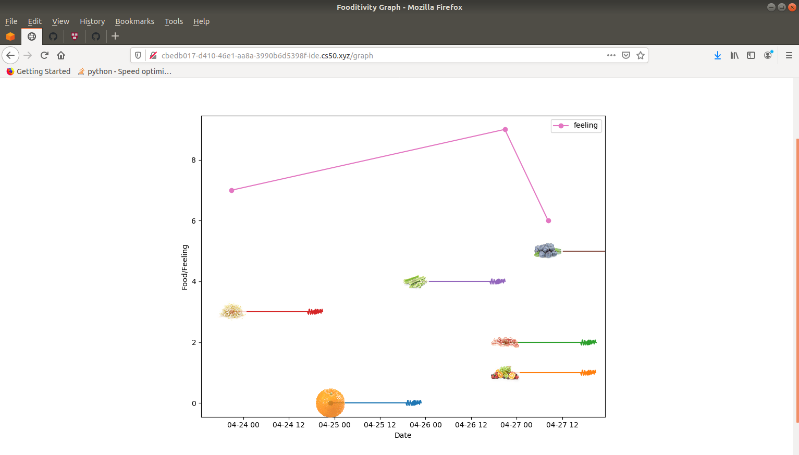

# Food-itivity
## A food sensitivity tool

Food-itivity is a food journal meant to help determine ingredients you may be sensitive to eating (i.e. mild food intolerances). The idea is that you can enter in what ingredients you eat, and when, then over time the program will attempt to find ingredients that have a pattern of making you feel worse after eating them. 

## How it works:

After you register for an account and log in, you are greeted with an empty table. 

 

To start out, you can click the "Eat" button in the navigation bar at the top of the screen. The program asks "What food did you eat?" and you can type in an ingredient, and an optional date for when you ate that ingredient. When you press the "Eat" button, the program records that you ate that food at that time in a sqlite database. 

  

You can record how you feel (from 1 to 10, 10 being the best, and 1 being the worst) over time by going to the "Record" page. You can choose a date and time for when your recording should be. The default is the present time. 

   

Once you have entered in some foods you ate and recorded some feelings, the program will try to analyze which foods make you feel worse. 

## The "algorithm"

The way the program determines whether you are sensitive to a food is as follows: 

the user defines a variable "d" (for digestion) to be a number of hours between 1 and 23 (default is 22), and a number "epsilon" (for small quantity) between 1 and 5 hours.

For each ingredient you ate, the program will look ahead "d" hours into the future. If you feel worse than average within "epsilon" of that time, that ingredient gets a point. Count up all the times that ingredient gets a point, and you get a number n_d(food), i.e. the number of times that food made you feel worse assuming a digestion time of d. 

The program calculates n_d(food) for each food. The foods with n_d(food) in the 90th percentile get flagged as foods you may be sensitive to. The index page (same as Analyze page) displays these foods and their n_d(food) numbers, as well as the average of how you felt after digesting that food for d hours. 

## The graph

Whenever you record eating an ingredient, the program uses the Spoonacular recipe and food API to find a picture of that ingredient. It then plots all the pictures of the ingredients via matplotlib, with the x axis as time and the y axis as feeling (the y-coordinates of foods are meaningless except to try to display them without overlapping). The x-coordinate of a food corresponds to when that food was eaten. 

In the same plot, the users feeling is graphed as a line graph over time. 

For each food plotted, a horizontal line of length d is also plotted, to help visualize how the program defines digestion. The squiggly area of width 2*"epsilon" at the end of each horizontal line describes when the program is looking for bad effects from that food. So if the squiggly line matches up with a time you felt worse than average, that is when that food gets a point. 

 

After you record a few things, the graph gets a little hectic, but what is measuring is a little hectic by default (there are so many ingredients in everything you eat). 

In a future version, it would be nice to have better labelling in the graph, or a way to toggle different display options. Also it would be nice to be able to shift all the ingredients pictures to the right by d. 

## Other pages:

There is a history page that logs all foods you've eaten. 

 

There is also a Configure page where you can change the values of d and epsilon. Currently d and epsilon always get reset after the user logs out. In a future version d and epsilon will be saved. 

 

## Future ideas:

Make a dropdown menu so you can select standardized ingredients via the Spoonacular API. 

Make it so that the program waits until there is a fair amount of data before concluding foods you're sensitive to. 

Make a way for the user to delete entries from the database.

Calculate the xmin and xmax values for the graph at a time other than while the graph is being generated, to save time. 

Generate the graph in the background to save loading time. 

